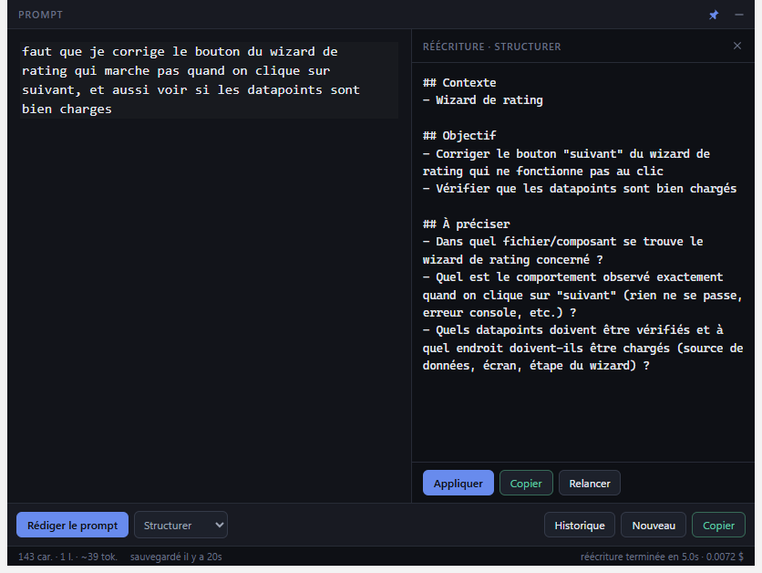

# Oxum Prompt Editor

A popup Markdown editor for writing prompts you can never lose, then pasting them into a
terminal agent such as Claude Code.

It exists to fix two specific annoyances of writing prompts directly in a terminal:

- **A stray `Ctrl+C` wipes what you were typing.** Here nothing can destroy the buffer.
  Every keystroke is autosaved atomically, closing only hides the window, and clearing or
  rewriting always archives first.
- **Newlines are awkward in a REPL.** Here `Enter` is just a newline, and `Ctrl+Enter` is the
  "send" gesture, which only ever copies to the clipboard.



## Install

```bash
npm install
npm run dev          # run from source
npm run dist         # build release/Oxum Prompt Editor-<version>-x64.exe (+ portable)
```

Requires Node 22+ and Windows. The installer is per-user, so it needs no administrator rights.

## Keyboard

The bindings deliberately invert terminal convention: `Enter` never submits.

| Key | Action |
| --- | --- |
| `Ctrl+Alt+Space` | **Global**: show / hide the popup, from any application |
| `Enter` | New line (continues lists and quotes) |
| `Ctrl+Enter` | Copy the whole document and hide the window |
| `Ctrl+Shift+Enter` | Copy without hiding |
| `Ctrl+R` | Rewrite with the selected preset |
| `Ctrl+Shift+R` | Open the preset picker |
| `Ctrl+N` | New prompt (the current one is archived first) |
| `Ctrl+H` | History panel |
| `Ctrl+Z` / `Ctrl+Y` | Undo / redo |
| `Ctrl+F` | Search within the draft |
| `Esc` | Close the open panel, or hide the window |

The window never quits from the UI. Use **Quitter** in the tray menu.

## How your text is protected

Four independent mechanisms, because losing a draft is the one failure this app cannot have:

1. **Atomic autosave** to `%APPDATA%\oxum-prompt-editor\draft.md`, 300 ms after you stop
   typing. The write goes to a temp file and is then renamed, so a crash mid-write can never
   truncate the file. Transient Windows rename failures (antivirus, indexer) are retried.
2. **A synchronous localStorage mirror** in the renderer, used at startup if the disk copy is
   empty because the main process died before its first save.
3. **Timestamped snapshots** in `history/`, taken on copy, before a clear, before applying a
   rewrite, before restoring, and on quit. Capped at 200, pruned oldest-first.
4. **Forced flush** on blur, on hide and before quit.

`Esc` and the close button only hide the window.

## Rewriting a prompt

The **Rédiger le prompt** button pipes the draft through the Claude CLI, reusing your existing
session, so there is no API key to configure.

The result appears in a side panel, never straight into your buffer. `Appliquer` archives your
original first and replaces the text in a single transaction, so one `Ctrl+Z` brings your own
wording back verbatim.

Every preset forbids the model from inventing content: unknowns are collected under a final
`## À préciser` section instead of being filled in with plausible guesses. Without that
constraint, rewriting reliably adds requirements you never wrote.

Built-in presets: **Structurer**, **Traduire (EN)**, **Condenser**, **Ticket**.

The CLI is invoked with `--tools ""` (no filesystem or network access), `--safe-mode` (ignores
your `CLAUDE.md`, hooks, MCP servers and skills, so results are fast and reproducible),
`--no-session-persistence`, and a hard `--max-budget-usd` cap. Cost and duration are shown in
the status bar after each run.

## Settings

`%APPDATA%\oxum-prompt-editor\settings.json`, edited by hand and re-read at startup. Invalid
values fall back to defaults rather than breaking the app.

| Key | Default | Notes |
| --- | --- | --- |
| `globalShortcut` | `Control+Alt+Space` | Falls back to the default if the OS rejects it |
| `alwaysOnTop` | `true` | Also toggled by the pin button |
| `hideOnBlur` | `false` | Off on purpose: a popup vanishing mid-thought is worse than a stray window |
| `openAtLogin` | `false` | Starts hidden via `--hidden` |
| `fontSize` | `15` | 10 to 32 |
| `model` | `sonnet` | Any alias or full model name |
| `claudePath` | `""` | Empty means auto-detect: PATH, then `%USERPROFILE%\.local\bin\claude.exe` |
| `defaultPresetId` | `structure` | |
| `maxBudgetUsd` | `0.5` | Per rewrite |
| `customPresets` | `[]` | Reusing a built-in `id` overrides it |

## Architecture

```
src/shared/contracts.ts   Types for every main <-> renderer channel: the single source of truth
src/main/                 Window, tray, global shortcut, stores, Claude CLI integration
src/preload/              contextBridge: one narrow typed API, no generic IPC passthrough
src/renderer/             CodeMirror 6 editor, toolbar, side panel, status bar
```

The editor holds **Markdown source**, styled but never transformed. What you see is byte-for-byte
what gets copied, so code fences, backticks and indentation cannot be mangled by a serialiser.
That is why this is not a WYSIWYG editor.

The renderer is sandboxed with `contextIsolation`, no `nodeIntegration`, a locked-down CSP and no
remote content. It reaches the filesystem only through the channels declared in `contracts.ts`.

## Tests

```bash
npm test         # Vitest: atomic writes, autosave, history pruning, stream parsing, settings
npm run lint
npm run typecheck
```
