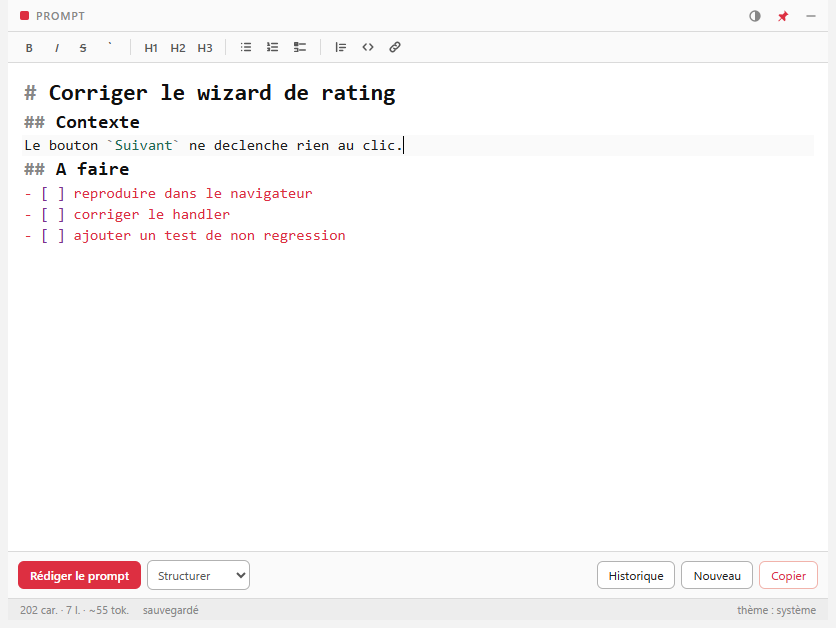
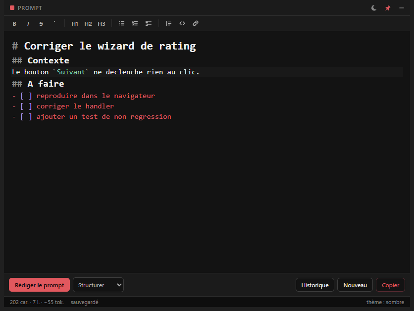

# Oxum Prompt Editor

A popup Markdown editor for writing prompts you can never lose, then pasting them into a
terminal agent such as Claude Code.

It exists to fix two specific annoyances of writing prompts directly in a terminal:

- **A stray `Ctrl+C` wipes what you were typing.** Here nothing can destroy the buffer.
  Every keystroke is autosaved atomically, closing only hides the window, and clearing or
  rewriting always archives first.
- **Newlines are awkward in a REPL.** Here `Enter` is just a newline, and `Ctrl+Enter` is the
  "send" gesture, which only ever copies to the clipboard.

| Light | Dark |
| --- | --- |
|  |  |

## Install

```bash
npm install
npm run dev          # run from source
npm run dist         # build release/Oxum Prompt Editor-<version>-x64.exe (+ portable)
```

Requires Node 22+ and Windows. The installer is per-user, so it needs no administrator rights.

## Keyboard

The bindings deliberately invert terminal convention: `Enter` never submits.

| Key | Action |
| --- | --- |
| `Ctrl+Alt+Space` | **Global**: show / hide the popup, from any application |
| `Enter` | New line (continues lists and quotes) |
| `Ctrl+Enter` | Copy the whole document and hide the window |
| `Ctrl+Shift+Enter` | Copy without hiding |
| `Ctrl+R` | Rewrite with the selected preset |
| `Ctrl+Shift+R` | Open the preset picker |
| `Ctrl+N` | New prompt (the current one is archived first) |
| `Ctrl+H` | History panel |
| `Ctrl+Shift+D` | Cycle the theme: light, dark, follow the system |
| `Ctrl+Z` / `Ctrl+Y` | Undo / redo |
| `Ctrl+F` | Search within the draft |
| `Esc` | Close the open panel, or hide the window |

The window never quits from the UI. Use **Quitter** in the tray menu.

### Formatting

Every toolbar button has a shortcut, and both paths run the same command, so there is one
implementation per action.

| Key | Action | | Key | Action |
| --- | --- | --- | --- | --- |
| `Ctrl+B` | Bold | | `Ctrl+1` `Ctrl+2` `Ctrl+3` | Heading 1 / 2 / 3 |
| `Ctrl+I` | Italic | | `Ctrl+Shift+U` | Bullet list |
| `Ctrl+E` | Inline code | | `Ctrl+Shift+N` | Numbered list |
| `Ctrl+Shift+X` | Strikethrough | | `Ctrl+Shift+T` | Task list |
| `Ctrl+K` | Link | | `Ctrl+Shift+.` | Quote |
| `Ctrl+Shift+C` | Code block | | | |

Every action **toggles**: pressing bold on bold text removes the markers instead of nesting them,
and a heading replaces a heading of another level rather than stacking prefixes. With no
selection, the word under the caret is used. Applying a prefix to twelve selected lines is one
transaction, so one `Ctrl+Z` undoes it.

Two shortcuts were chosen the hard way and are worth knowing about if you rebind anything:
digit combinations are layout dependent (on a Swiss/French keyboard `Ctrl+Shift+7` arrives as
`Ctrl+/` and gets eaten by the comment toggle), and `Ctrl+Shift+O` never reaches the renderer at
all because Chromium keeps it for its bookmark manager.

## How your text is protected

Four independent mechanisms, because losing a draft is the one failure this app cannot have:

1. **Atomic autosave** to `%APPDATA%\oxum-prompt-editor\draft.md`, 300 ms after you stop
   typing. The write goes to a temp file and is then renamed, so a crash mid-write can never
   truncate the file. Transient Windows rename failures (antivirus, indexer) are retried.
2. **A synchronous localStorage mirror** in the renderer, used at startup if the disk copy is
   empty because the main process died before its first save.
3. **Timestamped snapshots** in `history/`, taken on copy, before a clear, before applying a
   rewrite, before restoring, and on quit. Capped at 200, pruned oldest-first.
4. **Forced flush** on blur, on hide and before quit.

`Esc` and the close button only hide the window.

## Rewriting a prompt

The **Rédiger le prompt** button pipes the draft through the Claude CLI, reusing your existing
session, so there is no API key to configure.

The result appears in a side panel, never straight into your buffer. `Appliquer` archives your
original first and replaces the text in a single transaction, so one `Ctrl+Z` brings your own
wording back verbatim.

Every preset forbids the model from inventing content: unknowns are collected under a final
`## À préciser` section instead of being filled in with plausible guesses. Without that
constraint, rewriting reliably adds requirements you never wrote.

Built-in presets: **Structurer**, **Traduire (EN)**, **Condenser**, **Ticket**.

The CLI is invoked with `--tools ""` (no filesystem or network access), `--safe-mode` (ignores
your `CLAUDE.md`, hooks, MCP servers and skills, so results are fast and reproducible),
`--no-session-persistence`, and a hard `--max-budget-usd` cap. Cost and duration are shown in
the status bar after each run.

## Settings

`%APPDATA%\oxum-prompt-editor\settings.json`, edited by hand and re-read at startup. Invalid
values fall back to defaults rather than breaking the app.

| Key | Default | Notes |
| --- | --- | --- |
| `globalShortcut` | `Control+Alt+Space` | Falls back to the default if the OS rejects it |
| `themeMode` | `system` | `light`, `dark` or `system` |
| `alwaysOnTop` | `true` | Also toggled by the pin button |
| `hideOnBlur` | `false` | Off on purpose: a popup vanishing mid-thought is worse than a stray window |
| `openAtLogin` | `false` | Starts hidden via `--hidden` |
| `fontSize` | `15` | 10 to 32 |
| `model` | `sonnet` | Any alias or full model name |
| `claudePath` | `""` | Empty means auto-detect: PATH, then `%USERPROFILE%\.local\bin\claude.exe` |
| `defaultPresetId` | `structure` | |
| `maxBudgetUsd` | `0.5` | Per rewrite |
| `customPresets` | `[]` | Reusing a built-in `id` overrides it |

## Theming

Light, dark, or follow the OS, cycled with the titlebar button or `Ctrl+Shift+D`.

The **main process owns the decision**, not the renderer. The window's `backgroundColor` is what
Windows paints in the frame before the page renders, so if the renderer resolved the theme on its
own, summoning the popup in dark mode would flash white. `nativeTheme.themeSource` does the OS
tracking, and the same resolved value feeds both the window colour and the page attribute.

All colours are tokens in `src/renderer/styles/tokens.css`: one light set on `:root`, one dark set
under `[data-theme='dark']`. Markdown syntax colours are declared as tokens too, so a single
CodeMirror highlight definition serves both themes.

The dark palette is derived rather than invented: the saturated brand red that anchors the light
theme haloes and loses contrast against near-black, so the dark theme steps up to the palette's
own lighter tints. Same family, weight appropriate to the background.

## Architecture

```
src/shared/contracts.ts   Types for every main <-> renderer channel: the single source of truth
src/main/                 Window, tray, global shortcut, theme, stores, Claude CLI integration
src/preload/              contextBridge: one narrow typed API, no generic IPC passthrough
src/renderer/             CodeMirror 6 editor, format bar, side panel, status bar
src/renderer/styles/      tokens.css holds both palettes; app.css only references tokens
```

Running from source uses a **separate data directory** (`…\oxum-prompt-editor-dev`). Sharing it
with the installed app would mean sharing the draft file, the history and the single-instance
lock, so a dev run would overwrite real drafts and refuse to start whenever the installed app is
open.

The editor holds **Markdown source**, styled but never transformed. What you see is byte-for-byte
what gets copied, so code fences, backticks and indentation cannot be mangled by a serialiser.
That is why this is not a WYSIWYG editor.

The renderer is sandboxed with `contextIsolation`, no `nodeIntegration`, a locked-down CSP and no
remote content. It reaches the filesystem only through the channels declared in `contracts.ts`.

## Tests

```bash
npm test         # Vitest: atomic writes, autosave, history pruning, stream parsing, settings,
                 # and every formatting command against a headless EditorState
npm run lint
npm run typecheck
```

The formatting commands are covered without a DOM: `@codemirror/state` is DOM-free, so the real
transactions run in Node. The suites assert the resulting document *and* selection using a `|` /
`«»` notation, which is how the toggle edge cases (caret inside bold, task-to-bullet conversion,
ordered-list renumbering) stay pinned down.
